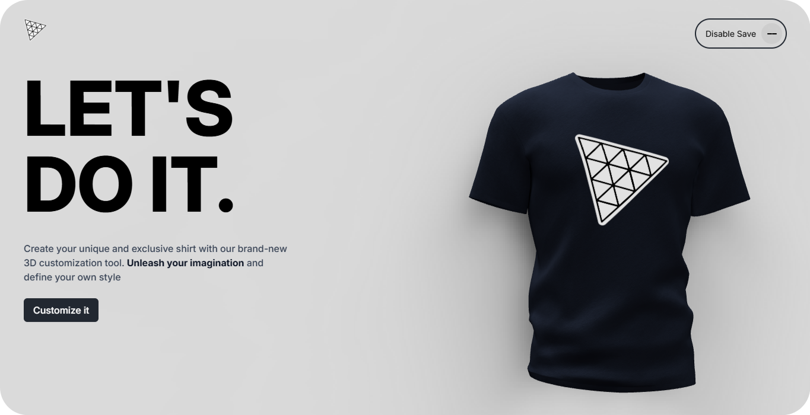

<!-- Main Image — Hero Section -->

  

<!-- Used Technologies -->

  
  
  
  
  
  

<!-- Project Name -->
<h3 align="center">3D Shirt Customizer</h3>
 

<!-- Project Type -->

  

 
 

<!-- Project Overview & Desc.. -->
## 📝&nbsp; About **3D Customizer**
⇨ Interactive 3D Shirt **`Landing Page`** designed to present a Real Product through a **clean, responsive and animated interface.** Showcasing **The Shirt** in a unique way since users can change it's **Color, Logo and Texture** → Download It!&nbsp; thanks to the power of `THREE.JS` and `R3F + R3Drei`. 

◈ `Fully Responsive` → Ensures flawless Responsiveness across all devices and screen sizes.

◈ `Optimized Performance` → Built for fast loading and an optimized experience.

◈ `Page Navigation Transition` → Enhance The `UX` with smooth transitions when users navigate different pages using `Framer-Motion`

◈ `Customizeable 3D Shirt Model` → The Magic ✨ → Explore the **Real 3D Shirt** from different angles using `Mouse-Tilt-Effect`. Evenmore you can customize the shirt's style concerning **MainColor, Logo and Texture**

◈ `Download The Result` → Not just Customize; you can Download the result you build as a `Full Screen Canvas` in High Qualiy.

◈ `LocalStorage Save Data` → While the user customize `LocalStorage` save data `Automatically` concerning: **MainColor, usedLogo, lastPage,...**, evenmore this feature can be toggled `ON/OFF`.

◈ `Eye-Catching 3D Effects` → Instead of a flat customizeable 3D Shirt Model, I used `React.3.Drei` to engage the look by providing **pageLoad Animations, Mouse-Move interaction and 3D Shadows.**

 

<!-- Real Showcase-->
## 🎬&nbsp; Demo & Showcase

https://github.com/user-attachments/assets/52c9bfcb-e391-4ec9-9a6d-4cddc48002a2

 

<!-- What Learn from that Project -->
## 🧠&nbsp; What I Learned 

① `Valtio — React` → Powerful React library for seamless `State Management` and powerful `LocalStorage Data Saving` &nbsp;▸ [Valtio.Dev](https://valtio.dev/docs/introduction/getting-started) ◂&nbsp;

② `Framer-Motion Page Transition` → Instead of creating real & static pages, **Framer-Motion** allows me to create fake pages that can be easy animated using `<AnimatePresence />`.

③ `Advanced React.Three.Fiber & Drei` → Dive deep into Shirt Model's Materials & Details which help me building `Interactive 3D Experience` for example: Changing Color, Texture and Logo. Evenmore engage the 3D Model with **3D Shadows, Mouse Interaction and PageLoad Animation.**
